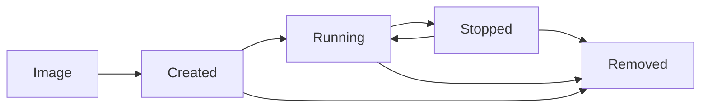

# 🏗️ Images & Containers Deep Dive

> **Think of it this way:** Images are like cookie recipes 📜, containers are the actual cookies 🍪 you bake from those recipes.

---

## 🎯 What You'll Master

- **Image Architecture** - Understanding layers, caching, and optimization
- **Container Lifecycle** - From creation to cleanup, managing the full journey  
- **Performance Optimization** - Building faster, smaller, more efficient images
- **Troubleshooting** - Debugging common image and container issues

---

## 📚 Understanding Docker Images

### The Recipe Analogy Deep Dive

Think of a **Docker image** like a detailed recipe for your grandmother's famous chocolate chip cookies:

```dockerfile
# Grandma's Cookie Recipe (Dockerfile)
FROM flour:all-purpose           # Start with base ingredient
RUN add butter sugar eggs        # Mix wet ingredients  
RUN add chocolate-chips          # Add the good stuff
RUN mix-until-combined           # Preparation steps
CMD bake-at-350-for-12-minutes   # Final instructions
```

Just like a recipe:
- ✅ **Reproducible** - Anyone can follow it and get the same result
- ✅ **Layered** - Each step builds on the previous one  
- ✅ **Shareable** - You can give the recipe to friends
- ✅ **Versionable** - You can have different versions (v1, v2, latest)

### Image Layers: The Layer Cake Architecture

Docker images are built in **layers** - think of it like a layer cake where each instruction in your Dockerfile adds a new layer:

```dockerfile
FROM ubuntu:20.04        # Layer 1: Base OS (like the cake base)
RUN apt-get update       # Layer 2: Update package list  
RUN apt-get install -y   # Layer 3: Install dependencies
COPY . /app              # Layer 4: Add your application code
CMD ["./app"]            # Layer 5: Set startup command
```

**Why layers matter:**
- 🚀 **Caching** - Unchanged layers are reused (faster builds)
- 💾 **Efficiency** - Shared layers save disk space
- 🔄 **Incremental updates** - Only changed layers need rebuilding

### Practical Example: Building a Web Application

Let's build a simple Node.js web app and understand each layer:

**Create your app:**
```bash
mkdir my-web-app && cd my-web-app
```

**package.json:**
```json
{
  "name": "my-web-app",
  "version": "1.0.0",
  "scripts": {
    "start": "node server.js"
  },
  "dependencies": {
    "express": "^4.18.0"
  }
}
```

**server.js:**
```javascript
const express = require('express');
const app = express();
const port = 3000;

app.get('/', (req, res) => {
  res.send(`
    <h1>🎉 Hello from Docker!</h1>
    <p>This app is running in a container!</p>
    <p>Build time: ${new Date()}</p>
  `);
});

app.listen(port, () => {
  console.log(`Server running at http://localhost:${port}`);
});
```

**Optimized Dockerfile:**
```dockerfile
# Layer 1: Base image (Node.js runtime)
FROM node:16-alpine AS base

# Layer 2: Set working directory (like preparing your workspace)
WORKDIR /app

# Layer 3: Copy package files FIRST (dependency layer)
# Why first? Because dependencies change less frequently than code
COPY package*.json ./

# Layer 4: Install dependencies
# This layer will be cached unless package.json changes
RUN npm ci --only=production && npm cache clean --force

# Layer 5: Copy application code
# This layer rebuilds whenever your code changes
COPY . .

# Layer 6: Create non-root user for security
RUN addgroup -g 1001 -S nodejs && \
    adduser -S nodejs -u 1001
USER nodejs

# Layer 7: Document the port (doesn't actually expose it)
EXPOSE 3000

# Layer 8: Define startup command
CMD ["npm", "start"]
```

**Build and run:**
```bash
# Build the image
docker build -t my-web-app .

# Run the container
docker run -d -p 3000:3000 --name webapp my-web-app

# Visit http://localhost:3000
```

---

## 🍪 Understanding Containers

### The Baked Cookie Analogy

If images are recipes, then **containers** are the actual cookies you bake:

| Aspect | Image (Recipe) | Container (Cookie) |
|--------|----------------|-------------------|
| **State** | Static, unchangeable | Dynamic, running |
| **Purpose** | Template/Blueprint | Actual running instance |
| **Quantity** | One recipe | Many cookies from one recipe |
| **Lifecycle** | Permanent (until deleted) | Temporary (can start/stop) |

### Container Lifecycle Deep Dive



#### Phase 1: Creation
```bash
# Create container but don't start it
docker create --name webapp my-web-app

# Check status
docker ps -a
# STATUS: Created (not running yet)
```

#### Phase 2: Running
```bash
# Start the created container
docker start webapp

# Or create and start in one command
docker run -d --name webapp2 my-web-app

# Check what's running
docker ps
# STATUS: Up X minutes
```

#### Phase 3: Monitoring
```bash
# Real-time resource usage
docker stats webapp

# Detailed information
docker inspect webapp | jq '.State'

# Application logs
docker logs -f webapp
```

#### Phase 4: Interaction
```bash
# Execute commands in running container
docker exec -it webapp sh

# Inside container, you can:
# - Check processes: ps aux
# - Check network: netstat -tlnp  
# - Check filesystem: ls -la /app
# - Check environment: env
```

#### Phase 5: Lifecycle Management
```bash
# Stop gracefully (sends SIGTERM, waits, then SIGKILL)
docker stop webapp

# Force stop immediately (SIGKILL)
docker kill webapp

# Restart (stop + start)
docker restart webapp

# Pause (freeze) - useful for debugging
docker pause webapp
docker unpause webapp
```

#### Phase 6: Cleanup
```bash
# Remove stopped container
docker rm webapp

# Force remove running container  
docker rm -f webapp

# Remove all stopped containers
docker container prune
```

---

## 🚀 Image Optimization Techniques

### 1. Multi-Stage Builds: The Production Kitchen

Think of multi-stage builds like having separate kitchen spaces for prep work and final plating:

```dockerfile
# Stage 1: The Prep Kitchen (build stage)
FROM node:16-alpine AS builder
WORKDIR /app
COPY package*.json ./
RUN npm ci --only=production

# Stage 2: The Final Kitchen (runtime stage) 
FROM node:16-alpine AS production
WORKDIR /app

# Copy only what we need from the prep kitchen
COPY --from=builder /app/node_modules ./node_modules
COPY . .

USER node
EXPOSE 3000
CMD ["npm", "start"]
```

**Benefits:**
- 🏋️ **Smaller final image** - No build tools, dev dependencies
- 🔒 **More secure** - Fewer attack surfaces
- 🚀 **Faster deployments** - Less to download and start

### 2. Layer Optimization: Order Matters

**❌ Inefficient (slow builds):**
```dockerfile
FROM node:16-alpine
WORKDIR /app

# Code changes frequently - this layer rebuilds often
COPY . .  

# Dependencies change rarely - but rebuilds every time code changes
COPY package*.json ./
RUN npm install
```

**✅ Optimized (fast builds):**
```dockerfile
FROM node:16-alpine
WORKDIR /app

# Dependencies first - cached when code changes
COPY package*.json ./
RUN npm install

# Code last - only this layer rebuilds when code changes
COPY . .
```

### 3. Using .dockerignore

Create `.dockerignore` to exclude unnecessary files (like `.gitignore` for Git):

```dockerignore
# Exclude development files
node_modules
npm-debug.log*
.git
.gitignore
README.md

# Exclude OS files  
.DS_Store
Thumbs.db

# Exclude IDE files
.vscode
.idea
*.swp
*.swo

# Exclude logs and temporary files
logs
*.log
tmp
temp
```

### 4. Choosing the Right Base Image

```dockerfile
# ❌ Large base image (1GB+)
FROM ubuntu:20.04

# ✅ Optimized base image (~100MB)
FROM node:16-alpine

# 🚀 Even smaller with distroless (~50MB)
FROM gcr.io/distroless/nodejs:16
```

---

## 🔍 Advanced Container Operations

### Health Checks: Container Wellness Monitoring

```dockerfile
# Add health check to Dockerfile
FROM nginx:alpine

# Copy custom config
COPY nginx.conf /etc/nginx/nginx.conf

# Define health check
HEALTHCHECK --interval=30s --timeout=3s --start-period=5s --retries=3 \
  CMD curl -f http://localhost/ || exit 1

EXPOSE 80
```

**Or define at runtime:**
```bash
docker run -d \
  --name healthy-webapp \
  --health-cmd="curl -f http://localhost:3000/health || exit 1" \
  --health-interval=30s \
  --health-timeout=10s \
  --health-retries=3 \
  my-web-app
```

**Monitor health:**
```bash
# Check health status
docker ps
# Shows (healthy) or (unhealthy) in STATUS

# Detailed health information
docker inspect healthy-webapp | jq '.State.Health'
```

### Resource Management: Setting Boundaries

```bash
# Memory limits
docker run -d --memory="512m" --name limited-app my-web-app

# CPU limits  
docker run -d --cpus="1.5" --name cpu-limited my-web-app

# Combined limits
docker run -d \
  --memory="1g" \
  --cpus="2.0" \
  --memory-swap="2g" \
  --name resource-limited \
  my-web-app

# Monitor resource usage
docker stats resource-limited
```

### Container Networking: Advanced Communication

```bash
# Create custom network
docker network create --driver bridge my-app-network

# Run containers on the network
docker run -d --network=my-app-network --name database postgres:13
docker run -d --network=my-app-network --name api my-api:latest  
docker run -d --network=my-app-network --name frontend my-frontend:latest

# Containers can now communicate by name:
# database:5432, api:3000, frontend:80
```

---

## 🛠️ Troubleshooting Guide

### Common Image Issues

**❌ Problem: Build fails with "No space left on device"**
```bash
# Solution: Clean up Docker system
docker system prune -a  # Remove all unused images, containers, networks
docker builder prune     # Clean build cache
```

**❌ Problem: Image build is too slow**
```bash
# Solution 1: Optimize layer order
# Put frequently changing layers last

# Solution 2: Use build cache
docker build --cache-from my-app:latest -t my-app:new .

# Solution 3: Use .dockerignore
# Exclude unnecessary files from build context
```

**❌ Problem: Image is too large**  
```bash
# Analyze image layers
docker history my-app:latest

# Use multi-stage builds
# Choose smaller base images (alpine, distroless)
# Clean up in same RUN command:
RUN apt-get update && \
    apt-get install -y package && \
    apt-get clean && \
    rm -rf /var/lib/apt/lists/*
```

### Common Container Issues

**❌ Problem: Container exits immediately**
```bash
# Check exit code and logs
docker ps -a  # See exit status
docker logs container-name

# Common causes:
# - Wrong CMD/ENTRYPOINT
# - Missing dependencies  
# - Permission issues
```

**❌ Problem: Can't connect to containerized service**
```bash
# Check port mapping
docker port container-name

# Check if service is listening
docker exec container-name netstat -tlnp

# Check from inside container
docker exec -it container-name curl localhost:3000
```

**❌ Problem: Container consuming too much memory**
```bash
# Monitor resource usage
docker stats container-name

# Set memory limits
docker update --memory="512m" container-name

# Check for memory leaks in application logs
docker logs container-name | grep -i "memory\|oom"
```

---

## 🎯 Hands-On Exercises

### Exercise 1: Build an Optimized Multi-Stage Image

Build a Go application with multi-stage build:

```dockerfile
# Build stage
FROM golang:1.19-alpine AS builder
WORKDIR /app
COPY go.mod go.sum ./
RUN go mod download
COPY . .
RUN CGO_ENABLED=0 GOOS=linux go build -o main .

# Production stage
FROM alpine:latest AS production
RUN apk --no-cache add ca-certificates
WORKDIR /root/
COPY --from=builder /app/main .
CMD ["./main"]
```

Compare sizes:
```bash
# Build both stages
docker build --target builder -t myapp:builder .
docker build -t myapp:production .

# Compare sizes
docker images | grep myapp
```

### Exercise 2: Container Health Monitoring

Create a web service with health checks:

```javascript
// server.js
const express = require('express');
const app = express();

let healthy = true;

app.get('/', (req, res) => res.send('Hello World!'));

app.get('/health', (req, res) => {
  if (healthy) {
    res.status(200).send('OK');
  } else {
    res.status(500).send('Not healthy');
  }
});

app.get('/toggle-health', (req, res) => {
  healthy = !healthy;
  res.send(`Health toggled to: ${healthy}`);
});

app.listen(3000, () => console.log('Server running on port 3000'));
```

Run with health check and test:
```bash
# Run with health check
docker run -d -p 3000:3000 \
  --health-cmd="curl -f http://localhost:3000/health" \
  --health-interval=10s \
  --name health-test myapp

# Watch health status  
watch docker ps

# Toggle health and observe
curl http://localhost:3000/toggle-health
```

---

## 📖 Key Takeaways

🎯 **Images are templates, containers are running instances**  
🏗️ **Layer optimization can dramatically improve build speeds**  
🔄 **Multi-stage builds create smaller, more secure production images**  
📊 **Resource limits prevent containers from consuming too many resources**  
🏥 **Health checks enable automatic container monitoring and restart**  
🧹 **Regular cleanup prevents disk space issues**

**Next up:** Ready to master data persistence? Check out [Volumes & Persistence](volumes_and_persistence.md) to learn how to handle data that survives container restarts!